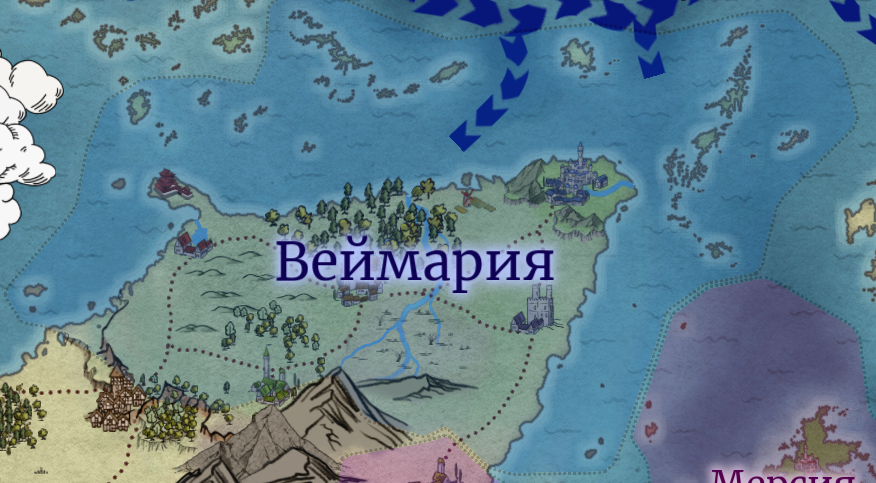
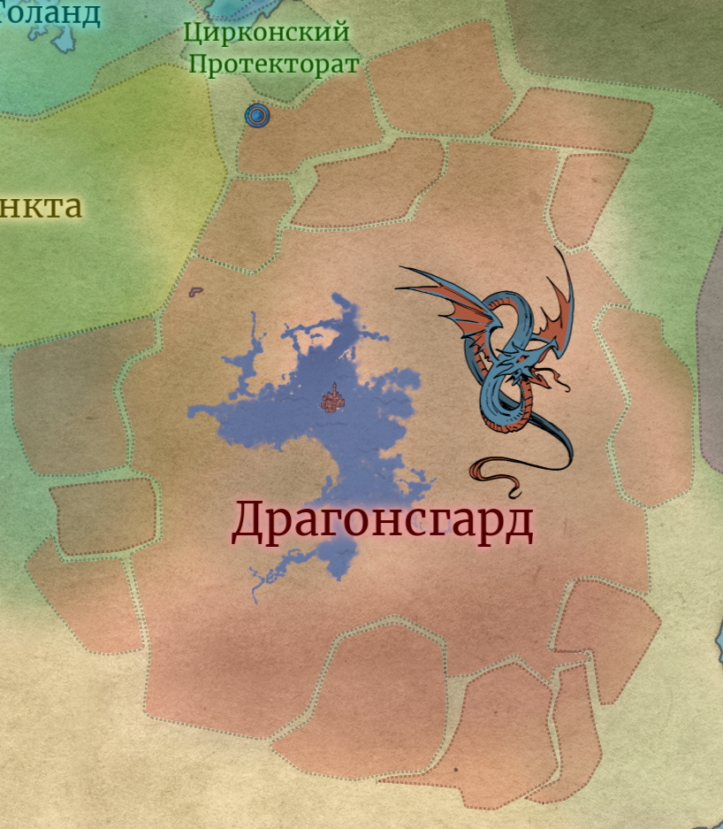
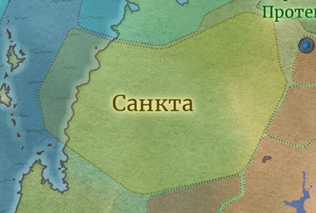
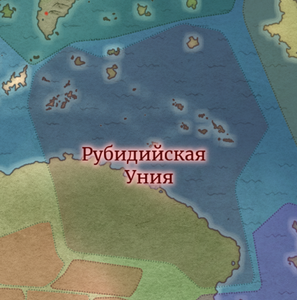
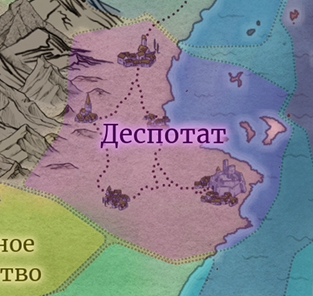
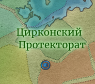

<h1 style="font-weight:bold; letter-spacing:2px; color:black; text-align: center;"> Государства </h1>

<!--

## Название государства
**Форма правления:**     
**Правитель:**   
**Столица:**   
**Краткое описание:**   
**Примечания:**  
 

-->

### Политическая карта мира

??? info - "тык"
    

### **Список государств**:
- [Веймария](#1)
- [Империя Драконов](#2)
- [Содружество](#3)
- [Санкта](#4)
- [Рассветное Княжество](#5)
- [Княжество Полуночи](#6)
- [Толанд](#7)
- [Орсалия](#8)
- [Рубидийская Уния](#9)
- [Мерсия](#14)
- [Деспотат](#15)
- [Циркония](#16)
- [Рубидийская Уния](#10)
- [ЧЕРНОВИК: Вальга](#11)
- [ЧЕРНОВИК: Японск](#12)
- [ЧЕРНОВИК: Китай](#13)

## Королевство Вейм**а**рия {#1}
**Форма правления:** монархия  
**Правитель:** *Король* Десимий Веймар  
**Столица:** Тальзур  
**Краткое описание:**    
Вы здесь.  
**Примечания:**  

+ Входит в Пояс Северных Королевств

+ Хорошо развита алхимия

??? note "Этимология"
    Названия **«Веймария»** происходит от *Веймарийского Грифона*, вида грифонов что гнездится на Пике Веймара - одной из самых высоких гор местного хребта и самой высокой точки Веймарии. <u> Веймарийский Грифон - символ и священное животное, охота на которое запрещена.</u>

 

??? info "**Карта**"
    

## Драгонсг**а**рд — Империя Драконов {#2}
**Форма правления:** де-юре - абсолютная республика, де-факто - диктатура   
**Правитель:** *Император* Этаморн Алое Пламя   
**Столица:** Доломин   
**Краткое описание:**   
Колониальная империя с мощной централизованной властью. За потомками драконов закреплены расширенные права и обязанности, они являются местной аристократией. Фактически в империи широко влияние кланов драконорожденных, полу-драконов и иных разумных, в которых течёт соответствующая кровь.   Существует отдельная каста Кобольдов, которые фактически являются привелигерованными рабами и слугами, оставаясь одной из самых многочисленных рас, населяющих страну.   
Возникла после **Войны Драконов** и фактической победы Хроматической стороны. За короткий срок образовала центральные территории, после чего начался период укрепления, накопления ресурсов и влияния. Вскоре после этого приступила к созданию колоний и переферийных провинций. 

**Примечания:**  

+ Широко распространено рабство 
+ Немногочисленные драконы занимают ключевые государственные позиции
+ Неспешная, но агрессивная политика

 

??? info "**Карта**"
    

## Содружество Княжеств {#3}
**Форма правления:** конфедерация, монархия   
**Правитель:** *Великий Князь* Анастас Громов  
**Столица:** Град  
**Краткое описание:**   
Несколько практически независимых княжеств, объединённых под в одну державу. Расположены на маленьком континенте Праземия, на северо-востоке, полностью занимают его, из-за чего выбить их оттуда очень сложно.  
Стилистически - славяне. Южные, Восточные и Западные, соответственно. Что-то навроде конфедерации.  
 

**Примечания:**  

+ Входит в Пояс Северных Королевств
+ 
 Референс:  Славяне  .

**Состав:**  

+ Вал**е**мия (Восток)
+ Гросл**а**вия (Юг)
+ **Э**льсборг (Запад)

 

??? info "**Карта**"
    

 

## С**а**нкта {#4}
**Форма правления:** Теократия  
**Правитель:** *Святовластитель* Эварист  
**Столица:** Агъё  
**Краткое описание:**   
Унитарная теократия, где религия не просто основа власти, но сама её суть. Страной правит **Святовластитель** — верховный жрец, считающийся живым орудием воли божества, а в этом ему помогает **Святой Престол** - высший религиозный совет. Все институты подчинены Церкви, светское право существует лишь как приложение к священному канону.  
Общество глубоко ритуализировано: церковь пронизывает каждый аспект жизни — от быта до управления. Региональное управление ведётся духовными наместниками. Ереси, инакомыслие и чужие культы строго запрещены, вера едина и обязательна.  
Но Санкта не замкнута в себе — она ведёт активную миссионерскую политику, считая распространение веры своим священным долгом. Жёсткая дисциплина и сакральный порядок подменяют свободу, но в обмен народ получает стабильность, защищённость и ясную цель в виде Служения.  

**Примечания:**  
+ 
 Референс:   Город Аквы из Коносубы.
 

 

??? info "**Карта**"
    

 

## Рассветное Княжество {#5}
**Форма правления:** Монархия  
**Правитель:** *Князь* Калейр Мальтри (Золотой Венец)  
**Столица:** Солария  
**Краткое описание:**   
Страна солнечных эльфов, где свет и тепло стали символами власти и силы.  
В течение веков  ведёт вялотекущую войну с Полуночью - наследницей и продолжательницей лунной линии эльфов. Изначально силы Рассветных превосходили врагов в качестве армии и магии, но после поражений при Пике Грёз и серии конфликтов с союзниками Лунных, потеряли значительные территории.  
Сегодня партитет сил сохраняется: княжество держит линии обороны и поддерживает политическое влияние на соседей, используя торговлю, дипломатию и магические школы для укрепления власти. В обществе ценят честь, дисциплину и ритуалы, основанные на солнечных циклах, а княжеский двор продолжает быть центром интриг и культурного развития.
 

**Примечания:**  
 

 

??? info "**Карта**"
    

## Княжество Полуночи {#6}
**Форма правления:**  Монархия   
**Правительница:** *Княгиня* Исиль Андюан (Закат)  
**Столица:** Лунария  
**Краткое описание:**   
Ггосударство лунных эльфов, где холодный свет и тень стали символами терпения и хитрости. 
Исторически Полуночь уступала Рассветным в грубой военной мощи, что побудило создать сеть марионеточных государств и союзников среди менее развитых краткоживущих народов, включая Тальзур, впоследствии занявший в регионе доминирующее положение. Благодаря этому, при поддержке «младших», Полуночи удалось одержать несколько тактических побед и провести масштабное контрнаступление на Пик Грёз, завершившееся незначительным успехом и изменением баланса сил в сторону паритета. Сегодня княжество балансирует между обороной и политическим влиянием, сохраняя магическую традицию и строгое соблюдение лунных обрядов. Полуночь известна осторожностью, дипломатическим терпением и умением использовать союзников для укрепления собственных позиций. 

**Примечания:**  
 

 

??? info "**Карта**"
    

## Королевство Т**о**ланд {#7}
**Форма правления:**  монархия с централизованным управлением и широким рыцарским сословием   
**Правитель:** *Король* Гильден IV  
**Столица:** Аранжель, город шпилей, мрамора и развивающихся знамен  
**Краткое описание:**   
Толанд - воплощение самого понятия «королевство»: торжественные клятвы, парады, турниры и пиры. Здесь всё подчинено идее величия - восстановленного, очищенного, возрождённого. Король - отец государства, рыцари - её сердце, а крестьяне - её кости. Магию в Толанде терпят, но не любят: истинная сила, говорят здесь, - в вере, чести и доблести.  
Но за фасадом пышных дворцов и старинных кодексов кипят интриги, хотя внешне страна выглядит как образец порядка и достоинства. Толанд - союзник Веймарии, гордый и верный, хотя втайне мечтает, чтобы именно его знамёна вновь стали символом возрождённой Тальзурской Империи.

Сильная королевская власть, развитая инфраструктура, идеология восстановленного величия. Входит в Союз Королевств, опирается на рыцарство, традиции, недолюбливает магию.  

**Примечания:**  
+ В обществе почитают рыцарские добродетели.
+ Главная гордость страны - инфраструктура, военные традиции и культурное наследие
+ Входит в Пояс Северных Королевств
+ Давний союзник Веймарии
+ 
 Референс:  Франция  .

 

??? info "**Карта**"
    

## Свободная Орсал**и**йская Республика (Орс**а**лия) {#8}
**Форма правления:** олигархическая торговая республика, управляемая советом домов и выборным доже    
**Правитель:** *дож* Мелдин ван Арест  
**Столица:** Кастеллион, город-гавань, где каждая улица пахнет солью, вином и золотом  
**Краткое описание:**   
Это узор из каналов, рынков и гаваней, где богатство говорит громче власти. Здесь не воюют мечом — здесь воюют монетой и словом. Купеческие дома правят так же жестоко, как другие - клинком, а видимость единства лишь скрывает вечную борьбу интересов. Орсалия не признаёт никаких королей и клятв, кроме одной - выгодной сделки. Её корабли стоят в каждом порту, а её золото течёт и к врагам, и к друзьям. Орсалийцы не верят в героев — лишь в тех, кто умеет оставаться на плаву, когда все прочие тонут. 

Богатая приморская страна с малыми территориями, торговая республика с мощным флотом. Правят купеческие дома, а не знать, хотя фактически, в контексте страны, эти слои общества ассимилировались друг с другом. Центр торговли и дипломатии.  

**Примечания:**  

+ Входит в Пояс Северных Королевств, но крайне редко вступает в военные конфликты.
+ Дипломатически гибкая, сохраняет нейтралитет ради торговли.
+ В обществе ценится практичность, вежливое коварство и показное благочестие.
+ Богатство страны - флот и контракты, а не земля.
+ 
 Референс:  Нидерланды и Венеция  .

 

??? info "**Карта**"
    

## Рубид**и**йская Уния {#9}
**Форма правления:**  вольная конфедерация племенных ханств, объединённых клятвой верности **Великому собору родов**   
**Правитель:** *Верховный хан* Кайр Асдарин  
**Столица:** Лаур-Бак, порт-крепость на изломанном побережье  
**Краткое описание:**   
Это не единая страна, а сговор потомков исконных рубидов. Ещё во времена ранней империи, их изгнали с  родины, что находилась южнее границ Веймарии. Впоследствии на эти земли пришли орки, переняв кочевой образ жизни. А рубиды устроили большое переселение, на тысяче кораблей отправившись по морям. Десятки лет скитаний лишь закаляли народ, пока не был найден новый спокойный берег, где меч сильнее закона, а кровь — лучшая валюта.  
Они говорят на десятках наречий, сражаются как волны - вместе и порознь, и в мире нет народа, который бы так быстро собирался под одни знамёна.  
Землю рубиды пашут неохотно: клинок и лошадь или лодка - вот их настоящие ремёсла. Они не строят империй, но рушат чужие. Соседи зовут их варварами и торговцами смерти, но охотно платят за их мечи. Война для рубида - ремесло, а месть давно стала памятью крови.  

**Примечания:**  

+ Уния держится на личных клятвах между ханами; при слабом верховном правителе распадается. 
+ Основные доходы — наёмничество, морской размен, налёты. 
+ Рубидская знать сохраняет традицию “даров ветра” — ритуальных гонок морских дружин. 
+ 
 Референс:  Монголы + Морские пираты  .

 

 

??? info "**Карта**"
    

## Королевство М**е**рсия {#14}
**Форма правления:** конституционная монархия с сильной исполнительной властью короны и ограниченным парламентом   
**Правитель:** Королева Аделиза  
**Столица:** Лоундхейм, портовый город на скалистом побережье пролива  
**Краткое описание:**   
Островное королевство, расположенное на одноимённом архипелаге, живущей силой не меча, но ума. Её политика - тонкая сеть интриг, сделок и манипуляций, где каждая война чужая, но каждая победа - своя. Здесь слово ценят больше стали, а дипломатия давно стала продолжением шпионажа. Флот невелик, но искусен. Торговля - прикрытие разведки. Союзники - лишь временные инструменты.  
Народ гордится «свободой под законом», хотя истинная власть прячется за улыбками министров и тенями Тайного совета. Мерсия - мастер выжидания: она редко делает первый шаг, но всегда ставит последнюю точку.  

**Примечания:**  

+ 
 Референс:  Великобритания  .

+ Входит в Пояс Северных Королевств, однако часто интригует из соображений личной выгоды, ведёт так называемую «Большую Игру».

??? note "Исторяи названия"
    Мерсийский Архипелаг, а потом и королевство Мерсия, получили свое название ещё во времена империи Тальзура. Когда-то давно имперский легат, возвращавшийся с посольства на Праземии попал в шторм. Ужасный и катастрофический, корабль грозило разорвать или кинуть на скалы юга, куда и занесло. 
    Легат начал истово молиться и просить милости - и боги дали её. Корабль выбросил на берега архипелага, обогнув все скалы и рифы, а острова с тех пор носят имя "милосердных", хотя множество утонууших в тех водах кораблей с этим не согласятся. 

 

??? info "**Карта**"
    

## Крент**и**йский деспотат {#15}
**Форма правления:** принципат при фактическом доминате  
**Правитель:** *Деспина* Ирена  
**Столица:**   
**Краткое описание:**   
**Примечания:**  
+ 
 Референс:  Византия .

 

??? info "**Карта**"
    

## Цирк**о**нский Протекторат {16}
**Форма правления:**  монархия   
**Правитель:** *Архонт* Сельвар Лотанис  
**Столица:** Цирконд, расположенный на береге реки, уходящей вглубь Киноваря  
**Краткое описание:**   
Государство Отверженных эльфов.  

**Примечания:**  
 

??? info "**Карта**"
    

## ЧЕРНОВИК: Каганат {#13}

## ЧЕРНОВИК: Вальга {#10}

## ЧЕРНОВИК: Японск {#11}
 

??? info "**Карта**"
    

## ЧЕРНОВИК: Китайск {#12}
 

??? info "**Карта**"
    